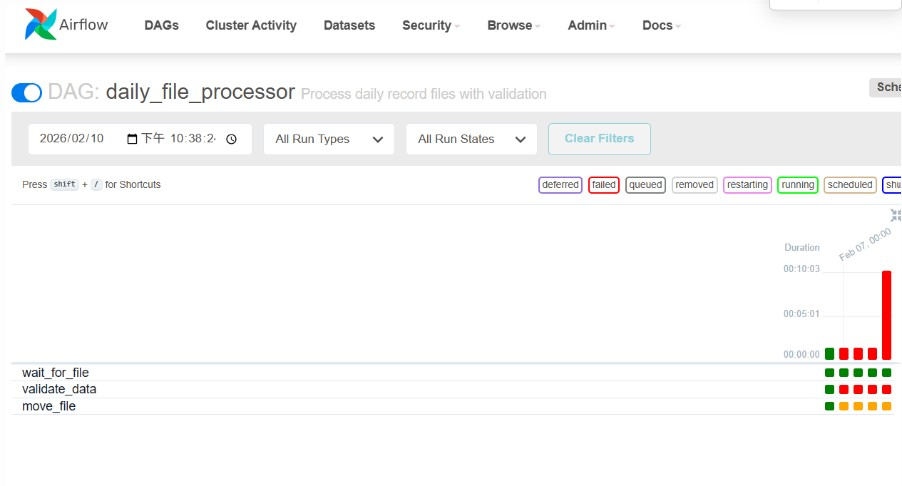
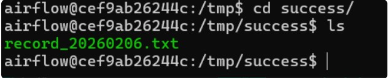
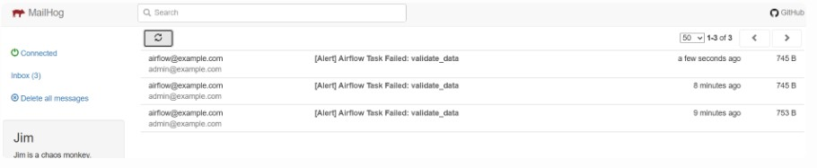
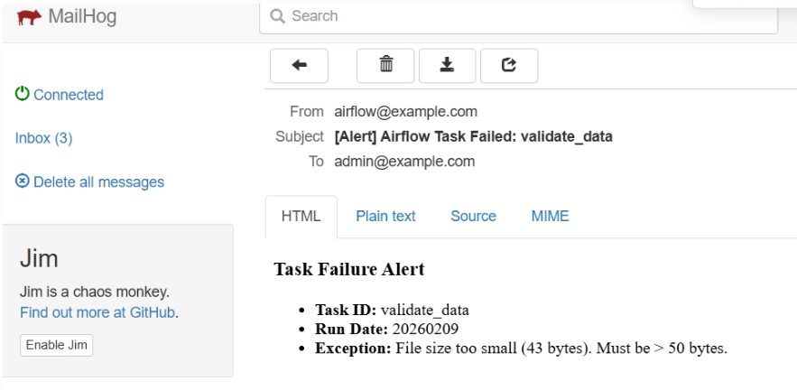
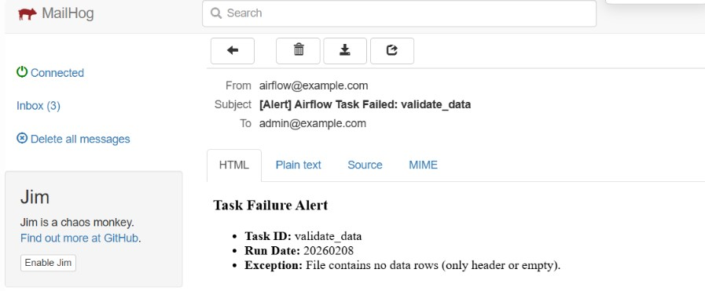
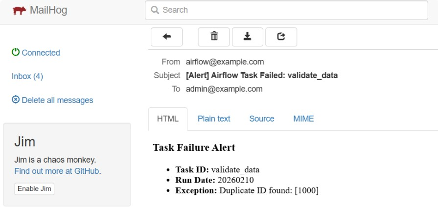
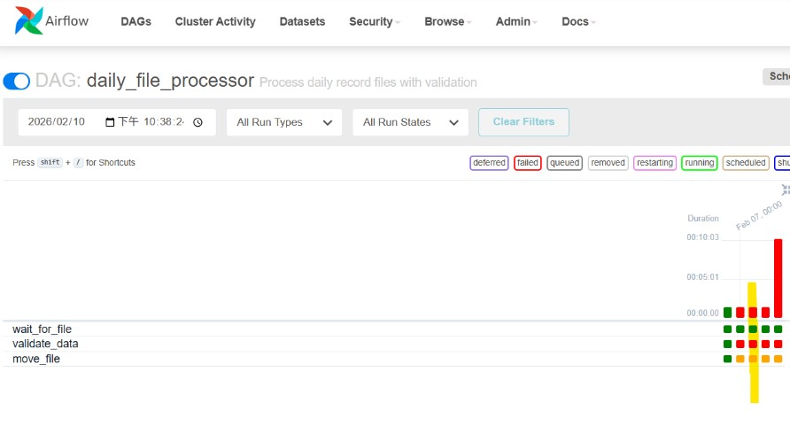

# Airflow File Processing Pipeline

本專案實作一個 Airflow DAG，用於每日自動接收、驗證並處理指定路徑下的檔案。

## 專案結構

```
airflow/
├── dags/
│   ├── common/
│   │   ├── __init__.py
│   │   └── utils.py          # 共用邏輯 (驗證、Email、路徑設定)
│   └── get_files.py          # 主要 DAG 定義
├── data/
│   ├── test/                 # 來源資料目錄 (對應container內 /tmp/test)
│   └── success/              # 處理成功目錄 (對應container內 /tmp/success)
├── docker-compose.yml        # Docker 服務設定
├── .env                      # 環境變數設定，正常情況下是不能上傳的，但是為了讓測試環境可以順利執行，暫時上傳
├── generate_fake_data.py     # 假資料生成腳本
└── README.md                 # 說明文件
```
## docker compose 服務

- mailhog: 1025
    - 接收測試 email
    - web UI: http://localhost:1025
- airflow 
    - scheduler
    - webserver: 8080
    - postgres: 5432
    - 使用 LocalExecutor 做簡單單機模式測試
- airflow cli
    - debug container

---

## (1) Airflow DAG 原始碼

### 核心 DAG: `dags/daily_file_processor.py`

負責定義排程、依賴關係與 Task 流程。

- **排程頻率**: 每天 00:00 (UTC+8)
- **回溯機制**: `catchup=True`，並設定 `start_date` 為 2 天前，確保啟動時會補跑前兩天的資料。
- **Sensor**: `FileSensor` 檢查 `/tmp/test/record_{yyyymmdd}.txt`，超時時間設為 30 分鐘 (00:30 UTC+8)。

### 共用邏輯: `dags/common/utils.py`

包含具体的 `validate_file` 函數與 `send_failure_email` 回調。

- **驗證項目**:
    1.  檔案大小 > 50 bytes (透過 `os.path.getsize` 與 `pandas` 若讀取失敗)
    2.  Header 以外資料筆數 > 0 (透過 `df.empty`)
    3.  ID 欄位值不重複 (透過 `df.duplicated().any()`)
- **告警**: 若驗證失敗或超時，觸發 `send_failure_email` 發送通知。

---

## (2) 執行說明與環境建置

本專案使用 Docker Compose 快速建置環境。

### 前置需求
- Docker version >= 28.0.0
- Docker Compose version >= 5.0.0

### 啟動步驟

1.  **進入專案目錄**
    ```bash
    cd airflow
    ```

2.  **啟動服務**
    ```bash
    docker-compose up -d
    ```
    

3.  **Debug 模式**
    ```bash
    docker-compose --profile debug up -d airflow-cli
    ```

4.  **存取 Web UI**
    -   網址: [http://localhost:8080](http://localhost:8080)
    -   帳號: `airflow`
    -   密碼: `airflow`

---

## (3) 假資料生成與測試

為了模擬來源系統拋送檔案，提供 `generate_fake_data.py` 腳本。

### 使用方式

1.  **生成今日正常檔案**
    ```bash
    python generate_fake_data.py --type valid --date (optional: YYYYMMDD，預設為當天)
    ```
    這會產生 `data/test/record_YYYYMMDD.txt`。

2.  **生成異常檔案 (測試驗證失敗)**
    -   **檔案過小 (<50 bytes)**:
        ```bash
        python generate_fake_data.py --type small
        ```
    -   **空資料 (僅 Header)**:
        ```bash
        python generate_fake_data.py --type empty
        ```
    -   **重複 ID**:
        ```bash
        python generate_fake_data.py --type duplicate
        ```

### 驗證流程
0.  假設今天是 2026-02-08，
    - `data/test/record_20260206.txt` -- valid 檔案
    - `data/test/record_20260207.txt` -- small 檔案
    - `data/test/record_20260208.txt` -- empty 檔案
    - 可直接使用 `python generate_fake_data.py --type duplicate` 生成當天的 duplicate 檔案
1.  啟動 Airflow (`docker-compose up -d`)。
2.  在 Web UI 開啟 `daily_file_processor` DAG。
    
3.  2/6 到 2/8 的資料會被執行。
4.  觀察 Airflow DAG 應成功執行 (Sensor 偵測到檔案 -> Validate 通過 -> Move 檔案)。
    -   檔案將從 `data/test/` 移動至 `data/success/`。
    
5.  測試異常情況：刪除成功目錄下的檔案，執行 `python generate_fake_data.py --type duplicate`，並在 Airflow 觸發 DAG (或等待排程)，應看到 Task 失敗並發送告警 Email (可於 Mailhog `http://localhost:1025` 查看)。
    
    - small file
        - 
    - empty file
        - 
    - duplicate id
        - 

---

## (4) 關於回溯 (Backfill)

題目要求：「DAG需回朔兩天前的資料」。
假設今天為 2026-02-08，則需要回溯 2026-02-06 和 2026-02-07 的資料。
但因為 start date 為資料時間，須設定為 2026-02-05，才能回溯到 2026-02-06 和 2026-02-07 的資料。

### 實作方式
在 DAG 定義中設定：
```python
start_date=datetime(2026, 2, 5, 0, 0, tzinfo=LOCAL_TZ),
catchup=True
```

### 說明
-   **`start_date`**: 設定為「現在時間減去 2 天」。
-   **`catchup=True`**: 告訴 Airflow 補跑從 `start_date` 到目前為止尚未執行的 DAG Runs。

當 DAG 首次被啟用 (Unpaused) 時，Airflow 會自動排程執行過去這兩天的任務，從而滿足「回溯兩天前資料」的需求。這在資料補償或新上線排程需處理歷史資料時非常有用。
- 如果當天是 2/8，則會自動 backfill 執行 2/6 和 2/7 的資料，紅線為當天的 dag run。

